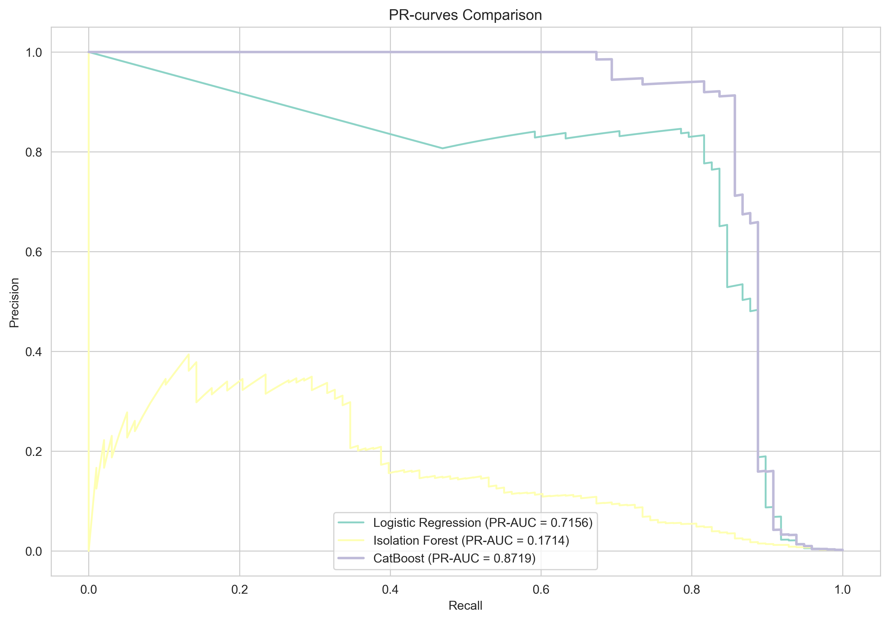

# Credit Card Fraud Detection

A machine learning project to detect fraudulent credit card transactions using a highly imbalanced dataset (0.17% fraud cases). This repository covers the complete workflow from data preprocessing to model training, evaluation, and interpretation.

## Key Results

- **Model:** CatBoost Classifier
- **Primary Metric:** PR-AUC (Precision-Recall Area Under Curve)
- **Performance:** Achieved a **PR-AUC of 0.87** on the test set, outperforming baseline models (Logistic Regression, Isolation Forest) by **22%**.
- **Interpretability:** Used **SHAP** to analyze model predictions, identifying key features driving fraud detection and providing insights into False Negative cases.
- **Business Impact:** The final model can identify **~85%** of fraudulent transactions while maintaining a False Positive Rate below **0.1%**, demonstrating a practical balance between security and user experience.

## Tech Stack

- **Python**
- **Core Libraries:** Pandas, Scikit-learn, CatBoost, SHAP, Matplotlib

## Project Structure

```
├── data/
├── notebooks/
│   ├── 01_EDA.ipynb
│   ├── 02_Baseline.ipynb
│   └── 03_Final_Evaluation.ipynb
├── images/
│   └── pr_curve_comparison.png
├── .gitignore
├── environment.yml         
└── README.md
```

## How to Run

1.  **Clone the repository:**
    ```bash
    git clone https://github.com/atmvsv/fraud_detection.git
    cd fraud_detection
    ```

2.  **Download the data:**
    Download the dataset from [Kaggle](https://www.kaggle.com/datasets/mlg-ulb/creditcardfraud) and place `creditcard.csv` into the `data/` directory.

3.  **Create and activate the environment:**
    Requires Conda or Mamba.
    ```bash
    mamba env create -f environment.yml
    mamba activate fraud_detection
    ```

4.  **Run the notebooks:**
    Start JupyterLab and execute the notebooks in numerical order.
    ```bash
    jupyter lab
    ```

## Performance

The CatBoost model demonstrates superior performance compared to the baselines, as shown by the Precision-Recall curve on the test set.

