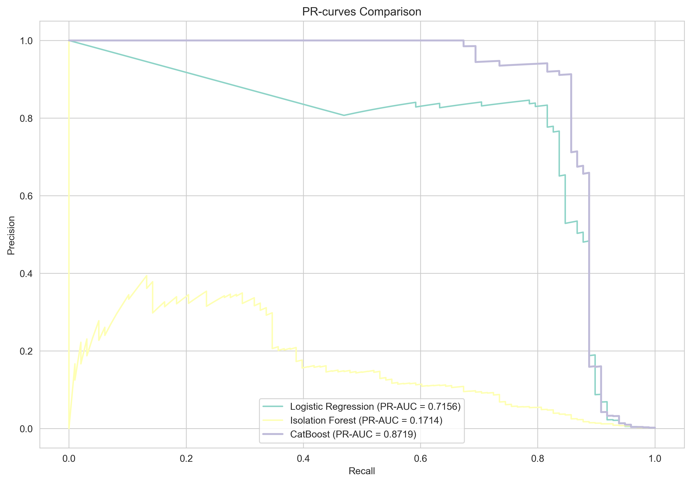

# Credit Card Fraud Detection

A machine learning project to detect fraudulent credit card transactions using a highly imbalanced dataset (0.17% fraud cases). This repository covers the complete workflow from data preprocessing to model training, evaluation, and interpretation.

## Key Results

- **Model:** CatBoost Classifier
- **Primary Metric:** PR-AUC (Precision-Recall Area Under Curve)
- **Performance:** Achieved a **PR-AUC of 0.87** on the test set, outperforming baseline models (Logistic Regression, Isolation Forest) by **22%**.
- **Interpretability:** Used **SHAP** to analyze model predictions, identifying key features driving fraud detection and providing insights into False Negative cases.
- **Business Impact:** The final model can identify **~85%** of fraudulent transactions while maintaining a False Positive Rate below **0.1%**, demonstrating a practical balance between security and user experience.

## Tech Stack

- **Python**
- **Core Libraries:** Pandas, Scikit-learn, CatBoost, SHAP, Matplotlib

## Repository Structure

```text
├── data/                         # local inputs and generated splits; not committed
│   ├── creditcard.csv            # source dataset downloaded from Kaggle
│   ├── X_train.feather           # generated by 01_EDA.ipynb
│   ├── X_test.feather            # generated by 01_EDA.ipynb
│   ├── y_train.feather           # generated by 01_EDA.ipynb
│   └── y_test.feather            # generated by 01_EDA.ipynb
├── fraud_detection/
│   ├── transactions.py           # transaction loading and schema validation
│   └── splits.py                 # deterministic stratified benchmark splits
├── tests/                         # fast synthetic unit tests
├── notebooks/
│   ├── 01_EDA.ipynb              # exploration, preprocessing, and train/test split
│   ├── 02_Baseline.ipynb         # baseline and CatBoost cross-validation
│   └── 03_Final_Evaluation.ipynb # final test evaluation and SHAP analysis
├── images/
│   └── pr_curve_comparison.png   # result figure regenerated by final evaluation
├── .gitignore
├── environment.yml               # portable direct Conda dependencies
└── README.md
```

The downloaded dataset and reproducible Feather splits stay outside version control. Model files, CatBoost training output, logs, notebook checkpoints, and operating-system metadata are also ignored.

## Setup

Requires Conda or Mamba. Conda remains the environment source of truth for this repository.

1. Clone the repository:

   ```bash
   git clone https://github.com/atmvsv/fraud_detection.git
   cd fraud_detection
   ```

2. Create and activate the environment:

   ```bash
   mamba env create -f environment.yml
   conda activate fraud_detection
   ```

   `conda env create -f environment.yml` can be used when Mamba is unavailable.

3. Download the [Credit Card Fraud Detection dataset from Kaggle](https://www.kaggle.com/datasets/mlg-ulb/creditcardfraud) and save it as:

   ```text
   data/creditcard.csv
   ```

## Reproduce the Workflow

Start JupyterLab from the repository and run the notebooks in numerical order:

```bash
jupyter lab
```

1. `notebooks/01_EDA.ipynb`
   - reads `data/creditcard.csv`;
   - performs preprocessing and the train/test split;
   - writes the four `data/*.feather` split files.
2. `notebooks/02_Baseline.ipynb`
   - reads the generated training split;
   - evaluates Logistic Regression, Isolation Forest, and CatBoost with cross-validation.
3. `notebooks/03_Final_Evaluation.ipynb`
   - reads the generated train/test splits;
   - evaluates the final models and SHAP explanations;
   - regenerates `images/pr_curve_comparison.png`.

Run each notebook from top to bottom before moving to the next one. A clean recreation should require only the repository, the documented Kaggle source file, and the Conda environment definition.

## Benchmark Split Protocol

The reusable benchmark splitter creates deterministic random stratified assignments with 64% of transactions for training, 16% for validation, and 20% for final testing. The same source rows and random seed produce the same assignments, and every transaction belongs to exactly one split.

This random stratified protocol keeps fraud representation stable for the initial reproducible offline benchmark. It does not simulate chronological deployment. Time-based validation remains future robustness work and is required before making claims about performance on future production transactions.

## Performance

The CatBoost model demonstrates superior performance compared to the baselines, as shown by the Precision-Recall curve on the test set.



## Repository Checks

From the repository root:

```bash
python -m unittest discover -s tests -v
git diff --check
python3 -c "import json, pathlib; paths=sorted(pathlib.Path('notebooks').glob('*.ipynb')); assert paths, 'no notebooks found'; [json.loads(path.read_text(encoding='utf-8')) for path in paths]"
```
